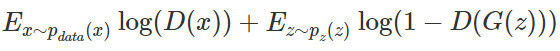

* [一些fancy的GAN应用](https://mp.weixin.qq.com/s/0I8jLO3srXC3fUdoMC585w)

* [机器之心GitHub项目：GAN完整理论推导与实现，Perfect！](https://zhuanlan.zhihu.com/p/29837245) \
    * 

* [深度 | 生成对抗网络初学入门：一文读懂GAN的基本原理（附资源）](https://mp.weixin.qq.com/s?__biz=MzA3MzI4MjgzMw==&mid=2650730721&idx=2&sn=95b97b80188f507c409f4c72bd0a2767&chksm=871b349fb06cbd891771f72d77563f77986afc9b144f42c8232db44c7c56c1d2bc019458c4e4&scene=21#wechat_redirect)
    * 你怎么教一台从未见过人脸的机器学会绘出人脸？计算机可以存储拍字节级的照片，但它却不知道怎样一堆像素组合才具有与人类外表相关的含义。
    * 很多各种各样旨在解决这一问题的生成模型。它们使用了各种不同的假设来建模数据的基本分布，有的假设太强，以至于根本不实用。
    * 对于我们目前的大多数任务来说，这些方法的结果仅仅是次优的。使用隐马尔可夫模型生成的文本显得很笨拙，而且可以预料；
    变分自编码器生成的图像很模糊，而且尽管这种方法的名字里面有「变」，但生成的图像却缺乏变化。
    所有这些缺陷都需要一种全新的方法来解决，而这样的方法最近已经诞生了。
    * 优秀的GAN的可能应用
        1. 模拟实验的可能结果，降低成本，加速研究；
        2. 使用预测出的未来状态来规划行动——比如「知道」道路下一时刻状况的 GAN；
        3. 生成缺失的数据和标签——我们常常缺乏格式正确的规整数据，而这会导致过拟合；
        4. 高质量语音生成；
        5. 自动提升照片的质量（图像超分辨率）；
    * 图像分类器本质上是高维空间中的一个复杂的决策边界。

* [深入浅出：GAN原理与应用入门介绍](https://mp.weixin.qq.com/s?__biz=MzA3MzI4MjgzMw==&mid=2650730028&idx=1&sn=21d57cf54f257aeab15ebd4058671a2b&chksm=871b2a52b06ca3449f255549a914e8ab8d85bb4d43e0487a95fd9ffd97e708d9eac7a1f9943b&scene=21#wechat_redirect)
    * 生成对抗网络不是神经网络应用在无监督学习中的唯一途径，还有玻尔兹曼机和自动解码器。
    三者皆致力于通过学习恒等函数 f（x）= x 从数据中提取特征，且都依赖马尔可夫链来训练或生成样本。
    